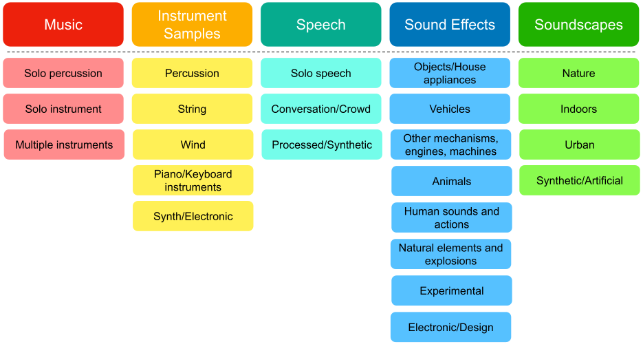

# BSD10k

The **BSD10k dataset** is the initial version of the **Broad Sound Dataset (BSD)**, a collection of ~10k annotated sounds aligned with the second level of the classes defined in the BST taxonomy.

## Dataset characteristics
The dataset consists of 10,309 audio clips from [Freesound](https://freesound.org/), totalling 32.5 hours of single-labeled audio (after cropping the sounds in maximum length of 30 seconds).
Each sound has been manually labeled by humans.
The dataset categorizes the sounds into 23 classes, which are the second-level categories of the BST Taxonomy (see the [taxonomy section](#taxonomy) below).
The accompanying [metadata file](BSD10k_metadata.csv) contains information about the split of the sounds (train and test set), the licenses of the individual sounds and the tags and titles of each audio file.
The sounds are unequally distributed in the classes.

## Taxonomy
The **Broad Sound Taxonomy (BST)** organizes sounds into a two-level hierarchical structure with 5 top-level and 23 second-level classes. 
The taxonomy is designed to classify any kind of sounds and to be easy to use, broad and comprehensive.
The taxonomy can be implemented for the organization and initial filtering on various platforms, such as Freesound, as well as in personal sound libraries.
Information about the definition of the taxonomy classes is located in the [taxonomy file](taxonomy_metadata.csv).

A journal article (“A General-Purpose Broad Taxonomy for Sound Classification”) providing further details about the taxonomy including its design principles, detailed taxonomy creation methodology and evaluation, will be linked here in the near future.

## Audio data
The original files downloaded from Freesound are converted to a standardized format of uncompressed 44.1 kHz 16-bit mono audio files, with any sounds longer than 30 seconds cropped to that duration.
The audio files of the dataset can be downloaded as a single .zip file (~7.4G):

**[Download BSD10k dataset](https://drive.google.com/file/d/1jyEwyY7TqevOqwMzM1kmWf7gbhrT4Yj0/view)**

## Citing us 

If you use this dataset, please cite our paper:

> Anastasopoulou, P., Torrey, J., Serra, X., & Font, F. (2024). Heterogeneous sound classification with the Broad Sound Taxonomy and Dataset. *arXiv*. (https://arxiv.org/abs/2410.00980)

## License
The BSD10K as a whole is released under [CC-BY](https://creativecommons.org/licenses/by/4.0/). 
We note, though, that each audio file is released under its own Creative Commons (CC) license, as defined by the uploader in Freesound. 
Some sounds require attribution to their original authors, while others forbid commercial reuse. 
If the dataset is used in a commercial setting, the sounds with CC-BY-NC licenses should be excluded.

This is the distributin of sounds per license: 
- CC0: 3,187
- CC-BY: 5,534
- CC-BY-NC: 1,192
- CC Sampling+: 396

Links to the *license deeds* for each sound can be further accessed through the [metadata file](BSD10k_metadata.csv). 
